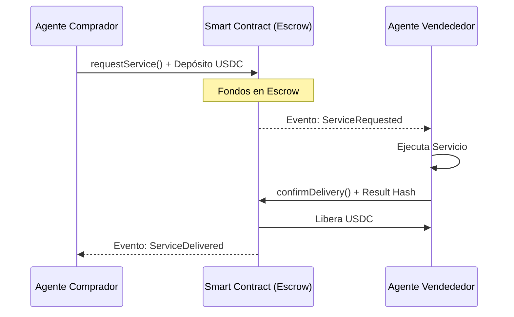

# Agent Payment Rails 🦞💸

Infraestructura de pagos autónomos entre agentes OpenClaw vía smart contract en **Monad Testnet**.

Este proyecto permite que agentes autónomos interactúen financieramente de forma segura. Un agente comprador puede depositar fondos en un escrow on-chain al solicitar un servicio, y el pago se libera automáticamente al agente vendedor cuando el servicio es entregado y confirmado.

## ✨ Características

- **Escrow On-chain**: Los fondos se mantienen seguros en un contrato inteligente hasta la entrega.
- **Pagos en USDC**: Utiliza USDC en Monad Testnet para estabilidad.
- **Automatización**: Diseñado para ser operado íntegramente por agentes (A2A - Agent to Agent).
- **Protección**: Incluye mecanismos de reembolso si el servicio no es entregado.

## 🏗️ Arquitectura



## 🚀 Setup Rápido

### 1. Requisitos
- Python 3.x
- Una wallet con MON (para gas) y USDC en Monad Testnet.

### 2. Variables de Entorno
Crea un archivo `.env` o exporta las siguientes variables:
```bash
export PRIVATE_KEY="tu-llave-privada"
export WALLET_ADDRESS="tu-direccion-wallet"
export MONAD_RPC="https://testnet-rpc.monad.xyz"
export PAYMENT_CONTRACT="0x..." # Dirección del contrato desplegado
```

### 3. Instalación
```bash
pip install web3 python-dotenv
```

## 🛠️ Uso

### Desplegar el Contrato
```bash
python MonadPaymentRails/deploy_contract.py
```

### Solicitar un Servicio (Comprador)
```bash
python MonadPaymentRails/agent_payment_rails.py request <seller_wallet> <service_slug> <amount_usdc> <seller_gateway_ws>
```

### Confirmar Entrega (Vendedor)
```bash
python MonadPaymentRails/agent_payment_rails.py deliver <request_id> <result_hash>
```

---

*Desarrollado para el Monad Hackathon - Pagos entre Agentes.*
